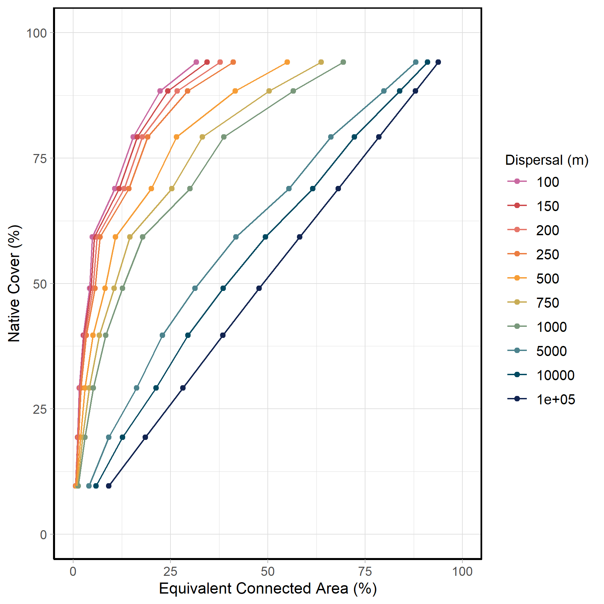
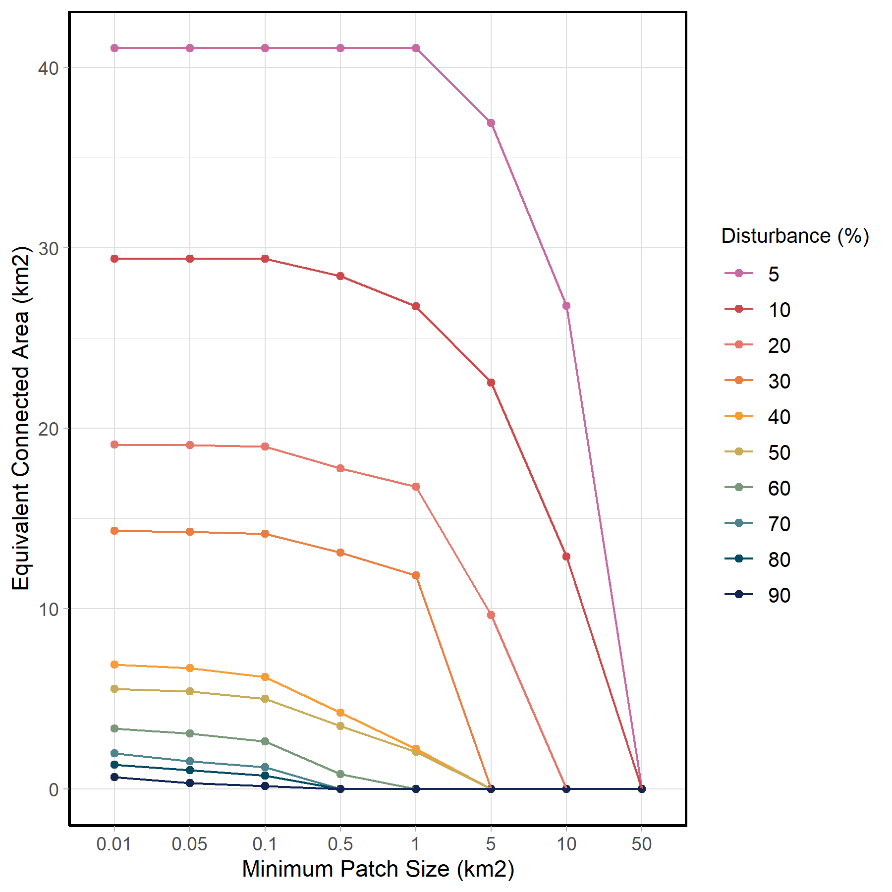

# Landscape Connectivity Indicator

## GIS Layers

The following GIS layers were used to delineate native habitat:

1) **ABMI Wall-to-Wall Vegetation Layer Including “Backfilled” Vegetation** is a provincial scale [GIS layer](https://abmi.ca/home/publications/451-500/467) that tracks the current vegetation, habitat, soil, and anthropogenic disturbances. This layer allowed us to assign habitat types (Upland Forest, Lowland Forest, and Grass-Shrub) and stand types for harvest areas which can be used to incorporate forest recovery curves for deciduous and coniferous stands. In addition, this layer provides information on the landcover types present prior to disturbance (i.e., backfill layer) which is used to determine the reference condition. We used version 7.0 of this layer (release date TBD), but it follows the same methodology as the cited version (6.0).

2) **Wildlife crossing locations in National Parks ** is a dataset on wildlife crossing locations was provided by Parks Canada that included information about where crossing infrastructures, such as overpasses and box culverts, occur in National Parks. This type of infrastructure can facilitate movement between habitat patches, reducing the impact of road development on connectivity.  

3) **The Human Footprint Inventory** is a provincial scale [GIS layer](https://www.abmi.ca/home/data-analytics/da-top/da-product-overview/Human-Footprint-Products/HF-inventory.html) that consolidates 115 types of anthropogenic disturbance into 20 subcategories. This layer allowed us to determine the loss of native habitat due to anthropogenic disturbance.

4) **Hierarchical Watershed Boundaries of Alberta** The Hydrologic Unit Code Watersheds of Alberta layer allows us to aggregate the status of AWNC and TNC based on ecologically relevant boundaries ([Hydrologic Unit Code Watersheds of Alberta](https://open.alberta.ca/opendata/gda-7857b6fb-96c5-4bc5-ac3a-9017778fd183)). We chose to aggregate the information at the HUC-8 watershed scale. Each HUC-8 watershed contains both AWNC and TNC, with TNC ranging between 3.5% to 94% across watersheds. However, these indicators can be reported at alternative spatial scales.

## Key Parameters

There are five key parameters for calculating the ECA index:  

- Dispersal distance: 250 m, representing how far a species can disperse. 

- Cost distance: 1 to 10, represents a scale for how difficult it is to move through the landscape. 

- Minimum viable patch size: one hectare. 

- Reference condition: landscape condition without any human footprint. 

- Recovery of forest harvest areas: harvest areas recover over time, and full recovery is achieved at stand age 80. 

### Dispersal

Different species have different dispersal capacities and thus different dispersal thresholds (e.g., maximum reachable distance within habitat). As a species’ dispersal capability increases, the ECA index converges with the proportion of available native habitat. In contrast, for small dispersal distance the ECA index will approach zero as species will be unable to move across even the smallest disturbances. Nevertheless, from an ecological perspective, some species may have very small dispersal distances and could still move very short distances in the landscape. However, from an application perspective, if the index converges to 0, it provides few opportunities for the index to provide meaningful information to land-use managers. Therefore, we needed to strike a balance between the index converging to the same value as percent native cover or converging to zero (i.e., no room for management action or prioritization).  

 

{width=80%}

Although we adopted a structural connectivity approach that is species agnostic, an assumption about dispersal threshold is still needed to be able to calculate connectivity among habitat patches. We chose to adopt a low dispersal distance of 250m so the indicator would be sensitive to species with dispersal limitations. If landscape connectivity is maintained for species with limited dispersal ability, species with much larger dispersal abilities will also be conserved. To apply the dispersal distance for calculating the Landscape Connectivity indicator, we followed an approach by @BlakeBaarda2018 and assigned the dispersal distance as the maximum distance of direct dispersal for the majority of species (95%) and twice the dispersal distance (500 m) for the remaining 5% of the species. This means that species have a 5% probability of direct dispersal to another patch 250 m away. It is important to acknowledge that rare long distance dispersal events occur. However, a maximum cut-off value is required to make the indicator computation feasible. Therefore, when calculating the Euclidean distance between two habitat patches, patches would have a 0% probability of direct dispersal if they were more than twice the dispersal distance (500 m) apart [@BlakeBaarda2018]. It is important to note that this maximum cut-off value does not limit the ability of species to move large distances within a watershed by moving through multiple native habitat patches that are close together (e.g., as steppingstones). 

### Cost distance

The ECA index has the flexibility to weigh the connections (i.e., links) between viable patches (i.e., nodes) based on the Euclidean distance between edges of patches, and the predicted cost (i.e., resistance) human footprint features or native landcover types exert on species. We drew on two published studies to assign cost values. @Marrec2020 developed a set of cost values for human footprint features based on the 2014 Human Footprint Inventory. The relative values of human modification, ranging between 0–1, were rescaled between 1–10 to allow for these costs to impact connectivity within a watershed, while acknowledging its impact should be secondary to the effects of habitat loss [(Table 3 layer)](ADD TECHNICAL DOCUMENT URL). Cost values of 1 indicate there is no additional cost to move between patches on top of the Euclidian distance between them, while a cost of 10 indicates it is 10 times more difficult to move between patches. To account for the variation in the degree of anthropogenic disturbances between forested (e.g., Green Area) and urbanized and agricultural (White Area) parts of the province [@GoA2022], we used the cost values developed for the forested area of the province for Upland Forest and Lowland Forest habitats and the values developed for the agricultural region for Grass-Shrub habitats. 

 
For native habitat types, we used cost values developed by @BlakeBaarda2018 [(Table 4 layer)](ADD TECHNICAL DOCUMENT URL).  Each habitat type has unique cost values associated with dispersing through unlike habitats (i.e., Grass-Shrub habitats dispersing through Upland Forest habitats had a lower cost than moving through Lowland Forest habitats). For open water and bare ground habitat types, we chose to use the maximum cost value of 10. This value was chosen because these habitat types are generally unsuitable for the terrestrial species represented by our 250 m dispersal distance (e.g., vascular plants, and invertebrates). It is important to note that the majority of open water and bare habitat types remain consistent in both the current and reference landscapes, or transition to footprint types that also have the maximum cost value. Only 0.05% of the landcover in Alberta, about 340 km2, transitions from the maximum cost value in the reference landscape to a lower cost value under current conditions. Therefore, the assignment of these cost values for open water and bare ground habitats should have minimal impact on the final indicator value.  

It is computationally intensive to determine the least-cost path between all viable habitat patches. This could make it difficult to incorporate this indicator into management practices. Therefore, we calculated cost distances using a 10 m raster and then calculated the average value for each HUC-8 watershed. It has been shown that using an average cost value results in less than a 1% difference in overall connectivity while significantly reducing the computational costs [@Saura2011]. The mean cost value for each HUC-8 watershed is calculated using both the backfilled reference condition and the appropriate Human Footprint Inventory (e.g., 2010, 2018, 2019, 2020, or 2021).  

### Minimum viable patch size

Every species requires a minimum amount of habitat to support aspects of their ecology (e.g., foraging and breeding). The amount of area required can range from a few square centimeters (e.g., microhabitats; moss on a decaying log), to very large areas that support larger organisms with bigger dispersal capabilities (e.g., large mammals). This range in variation makes it challenging to choose a minimum viable patch size that is meaningful across multiple species. 

Using guidance from both the NatureServe Conservation Status Assessment [@Master2021] and landscape disturbance simulations, we chose a minimum patch size of one hectare (0.01 km2). Setting a minimum viable patch size that is relatively small provides several key benefits: 

- Allows the indicator to be responsive to new disturbance in small (but greater than 1 ha) native habitat patches compared to a larger minimum viable patch size, 

- Prevents the indicator from converging rapidly to zero under varying amounts of human disturbance (Figure 21) compared to a larger minimum viable patch size, and  

- Reduces the computational resources required for this indicator as we ensure that polygon slivers are not considered as habitat patches compared to not having a minimum viable patch size.  

{width=80%}

We acknowledge that this minimum viable patch size does not represent all species. However, from the perspective of land-use planning, using a single minimum viable patch size allows for robust comparisons across regions. 

### Reference condition
We calculated the ECA index for multiple time steps (2010, 2018, 2019, 2020 and 2021) compared to a reference condition. The reference condition represents the state of the landscape in the absence of human footprint (i.e., backfilled layer), not a pre-colonialization landscape condition. In short, this is derived by filling in human footprint based on neighbouring native vegetation. The backfilled condition allows us to isolate the impacts of anthropogenic disturbance from other natural changes to landcover types over time. 

 

{width=80%}

### Recovery of forest harvest areas
Applying recovery to harvest areas when calculating current conditions gives a more realistic representation of how harvest areas interact with the surrounding ecosystem. It is well known in the scientific literature that forest harvesting, particularly clearcut harvesting, differs from wildfire in their impacts on biodiversity @McRae2001. Although harvest areas provide habitat for some species, they are not equivalent to post-fire forest stands of the same age. However, forest harvest areas do recover over time, and recovery curves recommended by @Huggard2015 for deciduous and coniferous forest types were applied when calculating the conditions of the AWNC and TNC indicators. These recovery curves were simplified to a single recovery curve to allow the AWNC and TNC indicators to be calculated using only publicly available GIS layers.

{width=80%}

