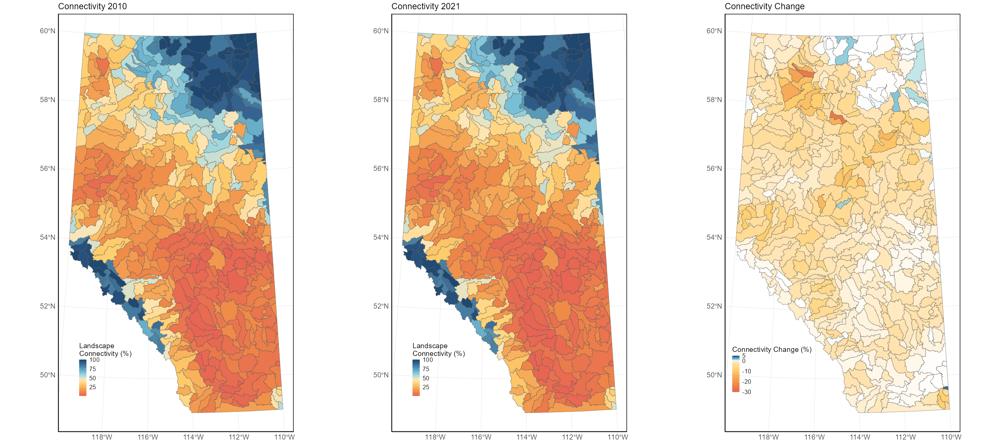
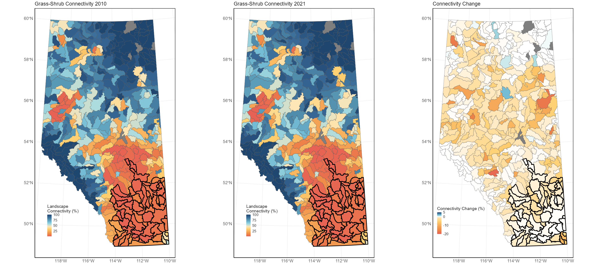
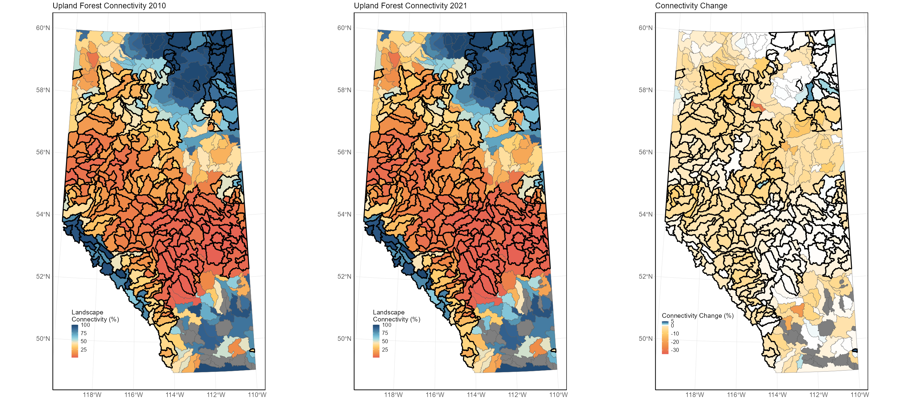
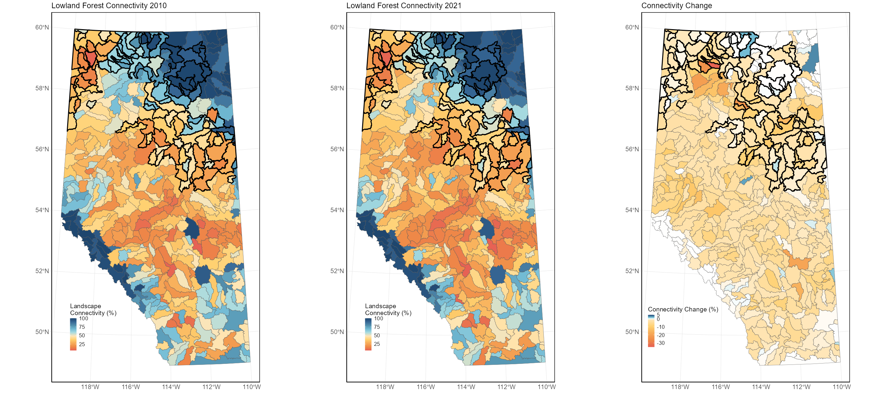

# Measuring Landscape Connectivity

## Aggregated Landscape Connectivity
Landscape connectivity was high in northeastern Alberta and the Rocky Mountains for all five years, as indicated by higher indicator values. On the other hand, lower connectivity values were detected in more developed areas such as the southern part of the province. Across all HUC-8 watersheds, landscape connectivity values ranged from 1.2% to 100% for all five years, with provincial averages of 35.5%, 33.7%, 33.5%, 33.4%, and 33.3% respectively, for 2010, 2018, 2019, 2020, and 2021. Results for all years are available on GeoDiscover Alberta ([Landscape Connectivity Indicator for Alberta](https://open.alberta.ca/opendata/gda-0f23e47d-fce1-4636-8760-02df5f83c18e)). 

{width=80%}

Landscape connectivity declined from 2010 to 2021 for most watersheds, with an average decline of 2.24% (sd = 3.16%) across all watersheds in the province (Figure 58). Of the 422 HUC-8 watersheds, landscape connectivity increased in 24 watersheds, decreased in 394 watersheds, and was stable in 4 watersheds. For the 24 watersheds that observed increases, only 7 had increases greater than 0.5%, while the remaining 17 had increases smaller than 0.5%. Of the 394 watersheds experiencing declines, 152 experienced declines greater than 2%, and 50 experienced declines greater than 5%. For two watersheds (HUC 18040203 and HUC 19010305), indicator conditions declined more than 25% (25.5% for HUC 18040203 and 25.9% for HUC 19010305) over the 11-year period, from 64.1% to 38.6% for HUC 18040203 and from 70.6% to 44.7% for HUC 19010305.  
## Landscape Connectivity for Grass-Shrub
Landscape connectivity for Grass-Shrub was low throughout the Grassland and Parkland Natural Regions. Focusing on watersheds where Grass-Shrub were the dominant habitat type under the reference condition (66 watersheds), average connectivity was 8.25% in 2010 (sd = 10.2%) and declined to 7.1% (sd = 8.9%) in 2021. Even though some watersheds saw large declines in connectivity, these are often restricted to areas where Grass-Shrub habitats are rare. However, Grass-Shrub habitats are the least connected habitat type in the province. 

{width=80%}

## Landscape Connectivity for Upland Forest
Landscape connectivity for Upland Forest was low throughout the Parkland and sections of the Boreal Forest Natural Regions. Focusing on watersheds where Upland Forest was the dominant habitat type (259 watersheds), average connectivity was 30.8% in 2010 (sd = 32.4%) and declined to 28.9% (sd = 32.7%) in 2021.  

{width=80%}

## Landscape Connectivity for Lowland Forest
Landscape connectivity for Lowland Forest was low throughout several Natural Regions, but had pockets of relatively connected habitat. Focusing on watersheds where Lowland Forest was the dominant habitat type (97 watersheds), average connectivity was 53.2% in 2010 (sd = 25.2%) and declined to 49.8% (sd = 25.5%) in 2021. This is the most connected habitat type in the province. However, it also had the largest average decline (3.4%) in connectivity between 2010 and 2021. 

{width=80%}

